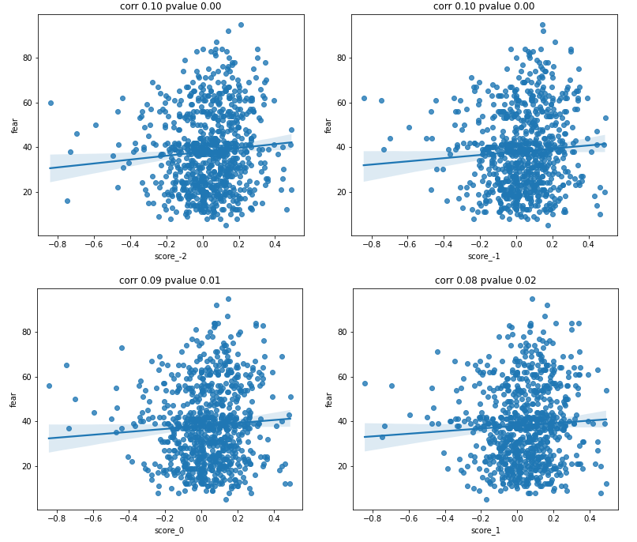
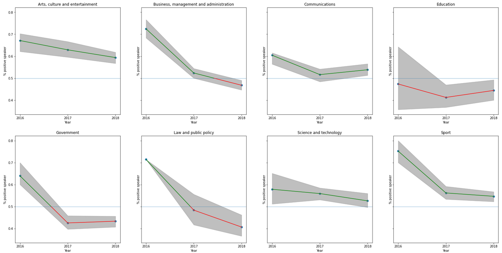

# ADA_Project

## Bitcoin Surging Or Crashing ? Let public figures decide.

## Abstract:
In the last five years, Bitcoin was by far the most volatile largely traded asset. Given its decentralized nature, multiple factors can manipulate its price direction. We would like to shed light on one of those factors: Public Speakers' Quotations. On one side, retail investors stem their entry and exit strategies (when to buy and when to sell) from the feeling conveyed by the subjective speeches of notorious public investors, which may cause drastic fluctuations in the bitcoin's price and trading volume. On the other hand, news and people in social media are known to be very reactive to the cryptocurrency market fluctuations. A fear and greed index reproduces this aspect based on crowdsourcing feelings from social media, Google trends and surveys analysis. 
Using the Quotebank dataset, we would like to investigate the correlation and the potential causality between the public speakers' quotes, the greed and fear index and Bitcoin’s historical data.

The full datastory of our project can be found here https://datakillers.xyz/
 
## Research Questions:
We would like to address the following research topics:
### How is the quotebank data related to bitcoin:
1) Is there any causation or correlation between the number of mentions of bitcoin and bitcoin's data?
2) Is there any causation or correlation between sentiments about bitcoin and bitcoin's data?
### Investigate potential biases in public speakers speeches about bitcoin:
1) Who are the top speakers about bitcoin and how is their sentiment about it?
2) What is the distribution of the sentiment about bitcoin over different occupation fields?
3) How does the sentiment about bitcoin evolve with respect to each occupation field? Can we observe any sentiment patterns?
4) What is the opinion of famous people about bitcoin? Do they maintain consistent opinions over time? Are they reliable?

## Proposed additional datasets:
- Bitcoin's data from 2014 to 2020 (https://www.kaggle.com/prasoonkottarathil/btcinusd): The dataset is available as a csv file. It contains the opening price, the closing price, the lowest price, the highest price as well as the traded volume with respect to three time intervals (1 min, 1 hour, 1 day). This Dataset will be the foundation of the statistical analysis on the variation of Bitcoin's price & volume. More about this is discussed in the methods.

- Bitcoin's fear and greed index dataset (https://alternative.me/crypto/fear-and-greed-index/): This is a simple dataset that stores the daily fear index from February 2018 in json format. This dataset will not only be used as a reference to assess our BERT model's sentiment analysis, but also as a tool to support our analysis and to potentially validate our conclusions on how the market/news react to Bitcoin's fluctuations. 

This is a [link](https://drive.switch.ch/index.php/s/ac01gxJ0XNRBf38) to all the necessary datasets that are needed to run the notebooks. 

The expected directory is the following: 
base_folder/M3/
Images/
Data/
Where "Data" folder contains all the data files contained in the aforementioned link.

## Methods:
<ul>
<li> Data loading, exploration and preprocessing: 
The first step would be to extract Bitcoin's quotes from the Quotebank dataset.  After cleaning it, some basic statistical summaries are displayed in order to identify the quotes distribution over time, as well as the most relevant speakers in this dataset.  
In order to make the best out of the sentiment analysis algorithm, we normalized data by lemmatizing it. We didn't apply other modifications such as case lowering and removing stop words because BERT model already takes these into account to determine the sentiment.
 </li> 

<li> Data processing:  
Most of our research questions involve comparing Bitcoin's data to the general sentiment in the public speakers' quotes and the cryptocurrency market. Therefore, we will be using a sentiment analysis model as the main processing technique throughout this project. The model consists of a pre-trained Zero-shot text classifier (https://arxiv.org/pdf/1909.00161.pdf) that classifies input statements according to the provided hypothesis. In our case, in order to obtain a robust sentiment model, we will compute the sentiment within Bitcoin statements in the quotebank dataset by aggregating the 8 outputs of a BERT model that computes the similarity between a given quotation and 8 hypothesis statements:  
 
In conclusion, we should (buy/use/encourage/keep/promote) bitcoin.  
In conclusion, we should not (buy/use/encourage/keep/promote) bitcoin.  
 
There are some concerns about bitcoin.  
There are no concerns about bitcoin.  
 
In conclusion, bitcoin has some drawbacks.  
In conclusion, bitcoin has some benefits.  
 
In conclusion, bitcoin is reliable.  
In conclusion, bitcoin is problematic.  
 
The final score is the sum of our model's confidences about the positive hypothesis minus the sum of the model's confidences about the negative hypothesis. 

 </li>  

<li> Data analysis:  
In order to confirm our correlation hypothesis we test correlations between the considered time series (fear index and final sentiment score) for different time lags.  

In order to provide rigorous answers to the aforementioned questions, we plan to use the principles shown in the lecture to tackle this observational study. If speeches are set to be the observed covariates, no one can prove the absence of other unobserved covariates influencing the Bitcoin's prices. In fact, given the complexity and the dimensions involved in such a competitive market, we can confidently assume the existence of non-negligible unobserved covariates affecting the outcome. Therefore, a sensitivity analysis must be performed to mitigate this concern.   
 
We use the granger causality test to verify whether we have different signals causing each other. This test provides the confidence about a causality through a p_value as well as the optimal time lag for the tested causality.  
 
Although our sentiment model aggregates results from different hypotheses, the sentiment score can be very noisy given that the used scores are also averaged over time or speakers, which might add different biases to the score. 
We therefore use a bootstrapping method to compute and display confidence intervals at confidence levels of 95%, when analysing sentiments over speakers or by occupation.  
 

 
</li>
</ul>
  

## Notebooks:
All of our notebooks contain an explanation of the motivation behind the codes, codes description as well as an analysis and discussion of our results.  
The references to NLP models and code helpers are cited in the sections where they are used in the corresponding notebook.  

**1.Bitcoin_Analysis.ipynb:** This notebook contains an updated version of the preliminary analysis performed in Milestone 2. It starts by extracting Bitcoin's related quotes from the quotebank dataset, followed by an exploration of the different datasets at hand. It also contains some baseline results of our sentiment model.  

**2.Occupation_mapping.ipynb:** Used to map occupations of speakers to 11 principal fields using a zero shot text classifier.  

**3.Sentiment.ipynb:** This notebook contains our final sentiment analysis model (aggregates sentiment scores from different hypotheses) as well as the pipeline to run the inference on the bitcoin quotes dataset.  

**4.Causality.ipynb:** Implements statistical tests to investigate correlations and causations between different signals in our dataset.  

**5.Occupation_Bias.ipynb:** Data analysis pipeline to assess the sentiment with respect to top 20 speakers, occupations and manually picked known speakers.  

## Organization within the team:

Dzung: Sentiment analysis pipeline, occupation mapping.

Taha: Causality checks, notebooks preparation.

Saad: Data analysis by speakers, data story.

Omar: Data analysis by occupations, data story.
